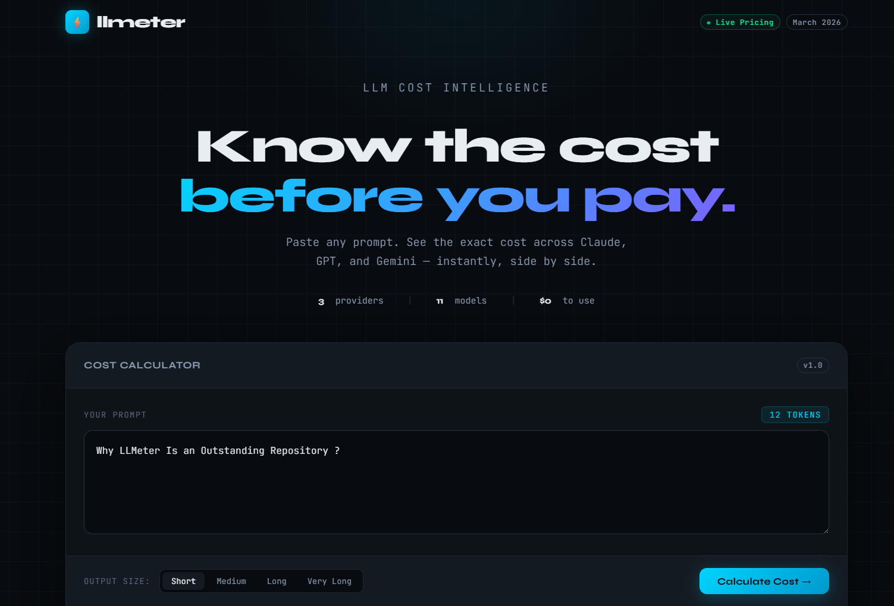
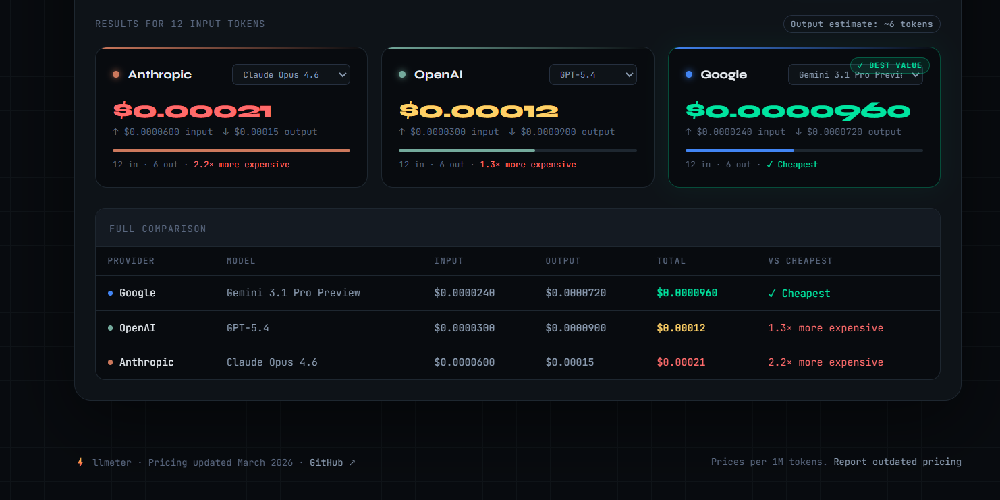

# ⚡ llmeter

> Real-time cost calculator & comparator for LLM APIs

[](LICENSE)
[](CONTRIBUTING.md)
[](https://github.com/themominpro/llmeter)

**llmeter** helps developers instantly calculate and compare the cost of running prompts across major LLM providers — before they get a surprise bill.

👉 **[Try it live →](https://thellmeter.vercel.app/)** 

**Main UI** 

**Stats UI** 


---

## 🤔 Why llmeter?

You write a prompt. You're not sure whether to use Claude, GPT-5, or Gemini. They all have different pricing models, token limits, and costs.

**llmeter answers in seconds:**
- How much will this prompt cost on each provider?
- Which model gives the best value?
- How does cost scale as my prompt grows?

No more guessing. No more surprise bills.

---

## ✨ Features

- ⚡ **Real-time cost calculation** — paste your prompt, see costs instantly
- 🔄 **Side-by-side comparison** — Claude vs GPT vs Gemini at a glance
- 🧮 **Token counter** — see exactly how many tokens your prompt uses
- 💰 **Always up-to-date pricing** — we track provider price changes
- 🌙 **Dark mode** — because developers live in the dark
- 📱 **Fully responsive** — works on mobile too

---

## 🤖 Supported Providers

> Pricing per 1 million tokens (input / output). Last updated: March 2026.

### Anthropic — Claude 4.x

| Model | Input | Output |
|-------|-------|--------|
| Claude Opus 4.6 | $5.00 | $25.00 |
| Claude Sonnet 4.6 | $3.00 | $15.00 |
| Claude Haiku 4.5 | $1.00 | $5.00 |

### OpenAI — GPT-5.x

| Model | Input | Output |
|-------|-------|--------|
| GPT-5.4 | $2.50 | $15.00 |
| GPT-5.4 Pro | $30.00 | $180.00 |
| GPT-5.2 | $1.75 | $14.00 |
| GPT-5 | $1.25 | $10.00 |
| GPT-5 Mini | $0.25 | $2.00 |

### Google — Gemini 3.x / 2.5

| Model | Input | Output |
|-------|-------|--------|
| Gemini 3.1 Pro Preview | $2.00 | $12.00 |
| Gemini 3 Flash | $0.50 | $3.00 |
| Gemini 2.5 Pro | $1.25 | $10.00 |
| Gemini 2.5 Flash | $0.30 | $2.50 |
| Gemini 2.5 Flash-Lite | $0.10 | $0.40 |

> ⚠️ Note: Gemini 2.0 Flash is deprecated and will be shut down June 1, 2026.
> Long-context pricing (>200K tokens) may differ — check the [pricing page](https://ai.google.dev/gemini-api/docs/pricing).

More providers coming soon (Mistral, Groq, DeepSeek) — contributions welcome!

---

## 🚀 Getting Started

### Use online
Visit **[llmeter.vercel.app](https://llmeter.vercel.app)** — no install needed.

### Run locally

```bash
# Clone the repo
git clone https://github.com/themominpro/llmeter.git
cd llmeter

# Install dependencies
npm install

# Start the dev server
npm run dev
```

Open [http://localhost:3000](http://localhost:3000) in your browser.

---

## 🛠️ Built With

- [Next.js](https://nextjs.org/) — React framework
- [Tailwind CSS](https://tailwindcss.com/) — Styling
- [Tiktoken](https://github.com/dqbd/tiktoken) — Token counting

---

## 🤝 Contributing

Contributions are what make open source amazing! Here's how you can help:

- 💰 **Update pricing** — LLM prices change often, PRs to update are always welcome
- 🤖 **Add a provider** — Missing your favorite LLM? Add it!
- 🐛 **Report bugs** — Open an issue
- 💡 **Suggest features** — We'd love to hear ideas

See [CONTRIBUTING.md](CONTRIBUTING.md) for guidelines.

---

## 📊 Pricing Data

All pricing data is sourced directly from official provider documentation:
- [Anthropic Pricing](https://platform.claude.com/docs/en/about-claude/pricing)
- [OpenAI Pricing](https://openai.com/api/pricing/)
- [Google Gemini Pricing](https://ai.google.dev/gemini-api/docs/pricing)

If you spot an outdated price, please [open an issue](https://github.com/themominpro/llmeter/issues) or submit a PR.

---

## 📜 License

MIT © [themominpro](https://github.com/themominpro)

---

<p align="center">
  If llmeter saved you money, give it a ⭐ — it helps more developers find it!
</p>
